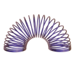

[](image.png)
# react-nodetoy

**react-nodetoy** allows you to export and use NodeToy graphs directly in your React websites.

🌈 [Nodetoy](https://nodetoy.co) is the shader tool for the web. NodeToy provides creators a powerful editor to create incredible new shaders and visual effects.

[Website](https://nodetoy.co/) &mdash;
[Twitter](https://twitter.com/nodetoy) &mdash;
[Discord](https://discord.gg/9ZbGRgZWeV) &mdash;

3️⃣ Using ThreeJs instead? Use [Three-NodeToy](https://github.com/NodeToy/three-nodetoy).

## Demos

[https://react-nodetoy.vercel.app/](https://react-nodetoy.vercel.app/)


## Install

With npm:
```sh
npm i @nodetoy/react-nodetoy
```

With yarn:
```sh
yarm add @nodetoy/react-nodetoy
```

Import `react-nodetoy` in your project:
```tsx
import { NodeToyMaterial } from '@nodetoy/react-nodetoy';
```

Declare your material inside your mesh component:

```tsx
<mesh>
  <boxBufferGeometry attach="geometry" args={[1, 1, 1]} />
  <NodeToyMaterial graph="https://draft.nodetoy.co/nFvoIaHuvkvm3uMa" />
</mesh>
```

If your materials are dynamic (use of Time, CosTime, SinTime, ...) add the `<NodeToyTick/>` component to your `<canvas>` component. See section `"Update Time / Dynamic uniforms"` for more information.

```tsx
NodeToyMaterial.tick();
```

## Example

```tsx
import { NodeToyMaterial } from '@nodetoy/react-nodetoy';

export default function App() {
  return (
    <Canvas>
      <mesh
        ref={ref}
        onClick={(e) => console.log('click')}
        onPointerOver={(e) => console.log('hover')}
        onPointerOut={(e) => console.log('unhover')}
        >
        <boxBufferGeometry attach="geometry" args={[1, 1, 1]} />
        <NodeToyMaterial graph="https://draft.nodetoy.co/nFvoIaHuvkvm3uMa" />
      </mesh>
    </Canvas>
  );
}
```

# Update Time / Dynamic uniforms

If you materials are using any time nodes (Time, SinTime, CosTime...), add the `<NodeToyTick/>` component to your canvas component. This will update the time of the materials every frame.

```tsx
import { NodeToyMaterial, NodeToyTick } from '@nodetoy/react-nodetoy';

export default function App() {
  return (
    <Canvas>
      <mesh>
        <boxBufferGeometry attach="geometry" args={[1, 1, 1]} />
        <NodeToyMaterial graph="https://draft.nodetoy.co/nFvoIaHuvkvm3uMa" />
      </mesh>
      <NodeToyTick/>
    </Canvas>
  );
}
```

## API

```ts
enum NodeToyCullMode {
  Front,
  Back,
  None,
};

interface NodeToyMaterialProps {
  url: string;
  parameters?: any;
  toneMapped?: boolean;
  flatShading?: boolean;
  transparent?: boolean;
  cullMode?: NodeToyCullMode;
  verbose?: boolean;
  polygonOffset?: boolean;
  polygonOffsetFactor?: number;
  depthTest?: boolean;
  depthWrite?: boolean;
  envMapIntensity?: number;
};
```

#### url : `string`

Define the NodeToy material to load. To export a material, open up the NodeToy material, click on the menu icon (top left corner) and select `Export Project...`. You can then generate a draft for your material, the URL will be generated for you.

#### parameters? : `Object`

Specifying the uniforms to be passed to the shader code. Those can be defined within the NodeToy editor by swiching inputs from `constants` to `parameters`.

#### toneMapped : `Boolean`

Defines whether this material is tone mapped according to the renderer's toneMapping setting. Default is true.

#### flatShading?: `boolean`

Define whether the material is rendered with flat shading. Default is false.

#### cullMode?: `NodeToyCullMode`

Defines which side of faces won't be rendered - NodeToyCullMode.front, back or none. Default is NodeToyCullMode.Back.

#### verbose?: `boolean`

Whether to print the full log of the material. Only useful for development. Default is false. 

#### polygonOffset?: `boolean`

Whether to use polygon offset. Default is false. This corresponds to the GL_POLYGON_OFFSET_FILL WebGL feature.

#### polygonOffsetFactor?: `Integer`

Sets the polygon offset factor. Default is 0.

#### depthTest?: `boolean`

Whether to have depth test enabled when rendering this material. Default is true.

#### depthWrite? : `Boolean`

Whether rendering this material has any effect on the depth buffer. Default is true.

When drawing 2D overlays it can be useful to disable the depth writing in order to layer several things together without creating z-index artifacts.


#### envMapIntensity?: `number`

Set the intensity of the environment map. Default is 1.0.


---

## Contributing

We use [yarn](https://yarnpkg.com/), install the dependencies like this:

```bash
yarn
```

### Development

```bash
yarn dev
```

and visit `localhost:3004/demo/Basic` to browse the examples in `./example` folder.

### Build Library

```bash
yarn build
```

### Publish on npm

```bash
yarn deploy
```
